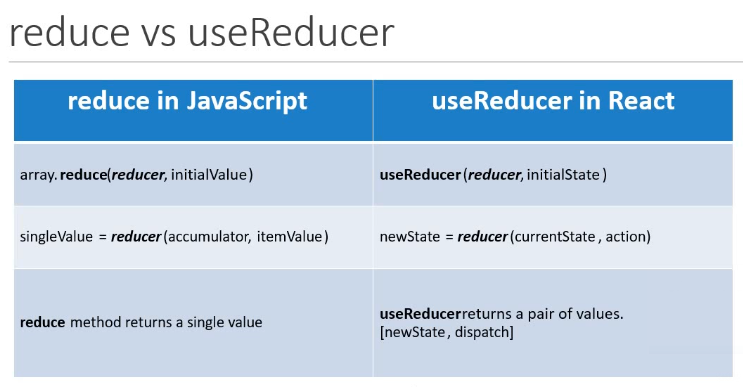

# useReducer

 useReducer is a hook that is used for state management. It is an alternative to useState. It helps us manage comples logic in React applications.
 
What is a reducer in react?

The ```reduce()``` method in javascript executes a ```reducer``` function on each element of the array, resulting in a single output value.

```js
const array1 = [1, 2, 3, 4];
const reducer = (previousValue, currentValue) => previousValue + currentValue;

// 1 + 2 + 3 + 4
console.log(array1.reduce(reducer));
// expected output: 10

// 5 + 1 + 2 + 3 + 4
console.log(array1.reduce(reducer, 5));
// expected output: 15

```

The ```reduce()``` method takes two values a ```reducer``` function and a second value that the reducer function can take use of. The reducer function itself takes two arguments and reduces them down to a single value and returns that value.



- useState is built using useReducer
